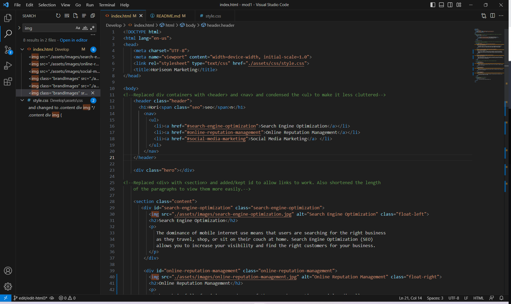
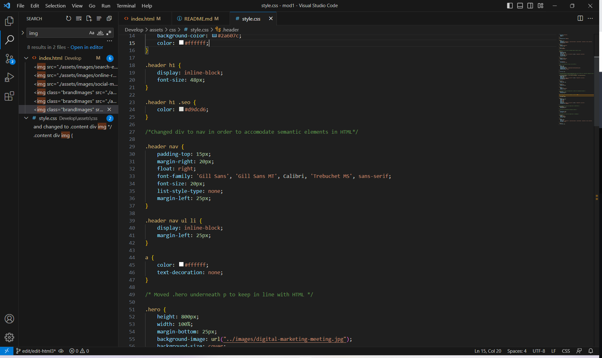

# Module 1 Challenge: Horeison Marketing (HTML and CSS editing)

## Description

This website was designed to offer marketing and management solutions to clients. The purpose of my
work was to refactor the previous code and consolidate needless elements and restrcture the files to make
them more accessible in the future.

By organizing and restructuring the files, the site is much easier to manage. The files have been
organized in a way that allows an editor to easily locate different elements in both HTML and CSS.
By changing the different semantic tags and removing needless ones, the site is now formatted
in a way that makes each section easily identifiable. By restructuring and grouping similar classes
and elements, I was able to reduce the size of the code. I also aimed to list classes in order
of appearance in the CSS file.

I learned a great deal with this project. By going through each part of the file and analyzing it, I 
was able to gain a much better understanding of how the code is written as well as effective ways of
organizing elements. I learned what elements are necessary and how classes nested within eachother 
interact. I learned how commenting is essential to communicate what is being done to a file and how
it can make things easier for the person who works on the file after you. A lot of research and review
of past materials was done in order for me to complete this project. Through this project, I also
learned a great deal about Git functions and how important they are in a working environment. I made
sure to push my files several times for practice. Most importantly, this project inspired me to review
and research materials to further understand the concepts that I have learned.

## Installation

N/A

## Usage

The site itself is used to provide marketing and management solutions to clients. The main page provides
brief descriptions on the services they offer. At the top of the page, a user can access relevant 
information to suit their purpose.

## Credits

The files necessary for this project were pulled from The Coding Bootcamp's GitHub respository.
https://github.com/coding-boot-camp/urban-octo-telegram

## License

Please refer to the LICENSE in the repo.

## Link

https://ryan9698.github.io/mod1-challenge/

## Screenshots of HTML/CSS file:

